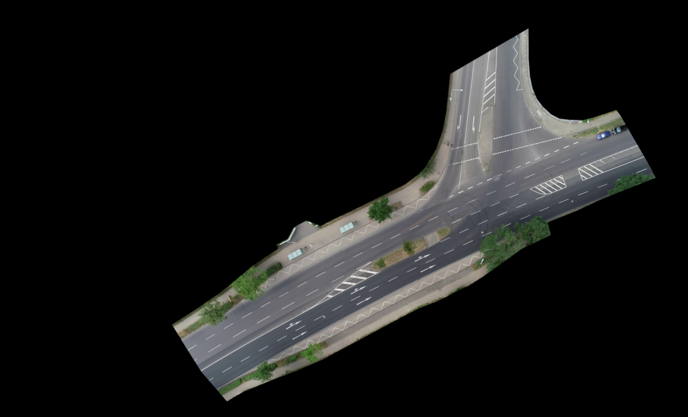
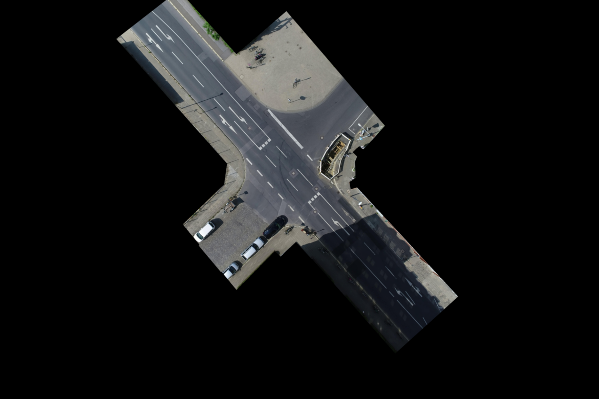
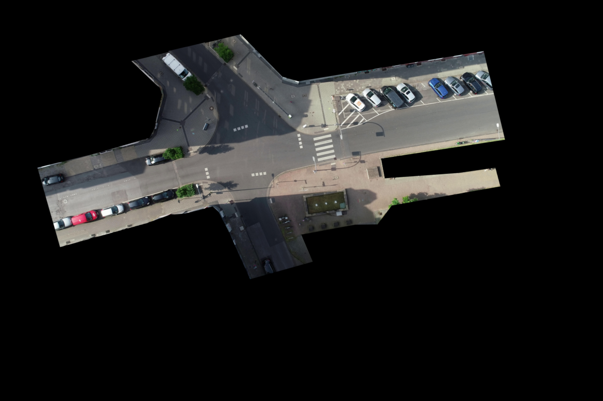
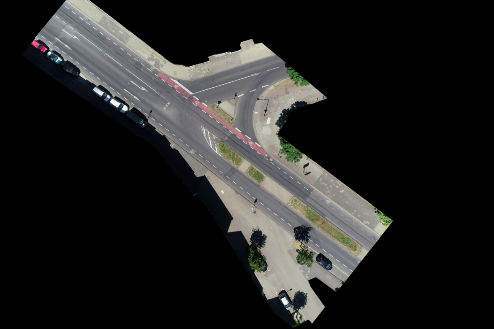

# Motion Prediction for Automated Vehicles Using the inD Dataset

This project leverages the **inD dataset** to develop and evaluate a neural network model for predicting the motion of road users (vehicles, pedestrians, etc.) at intersections. The model is trained to predict future positions and orientations based on historical data, which is valuable for applications in automated driving, safety validation, and traffic behavior analysis.

## Table of Contents
1. [Project Objective](#project-objective)
2. [Dataset Description](#dataset-description)
3. [Project Workflow](#project-workflow)
4. [Dataset Components](#dataset-components)
5. [Locations in the Dataset](#locations-in-the-dataset)
5. [Evaluation Metrics](#evaluation-metrics)
6. [Usage Instructions](#usage-instructions)
7. [License and Citation](#license-and-citation)

---

## Project Objective

The objective of this project is to predict the future positions and orientations (heading directions) of road users at intersections. This helps to anticipate the movements of various road users in real-time, supporting advancements in automated driving systems, urban planning, and traffic management.

## Dataset Description

The **inD dataset** is a comprehensive collection of naturalistic traffic trajectories recorded at German intersections using drones. The data includes high-quality trajectories of various road users (vehicles, pedestrians, bicyclists), with each trajectory annotated with information on position, speed, and orientation over time. The use of drones minimizes occlusions and provides a complete bird's-eye view of intersection interactions.

Key features of the dataset:
- **Four intersection sites** in Germany, each with unique layout and traffic patterns.
- **Multiple road user types**: vehicles, pedestrians, and bicyclists.
- **High positional accuracy** (typically within 10 cm).
- **Detailed data for each frame**, including x, y positions, velocities, and acceleration.

## Locations in the Dataset

The dataset includes recordings from four distinct locations, each with unique characteristics that add variety to the data. Here’s an overview of each location, along with a representative image for each:

1. **Bendplatz, Aachen**:
   - Features a four-armed intersection near a university, with a mix of cars, buses, pedestrians, and bicyclists.
   - Main interactions involve left turns and mixed-use paths.
   
   

2. **Frankenburg, Aachen**:
   - A residential area with a zebra crossing and high pedestrian traffic.
   - Features frequent interactions between vehicles, bicyclists, and pedestrians.
   
   

3. **Heckstrasse, Aachen**:
   - A T-junction in a suburban setting with cycle paths and pedestrian crossings.
   - Interaction hotspots are primarily left turns and pedestrian crossings.
   
   

4. **Neuköllner Strasse, Aachen**:
   - Located in an industrial area with a double-laned priority road.
   - High bus traffic due to proximity to a bus depot, creating a mix of pedestrian and vehicular interactions.
   
   

Each location provides a different layout, road user composition, and interaction type, making the dataset diverse and suitable for training robust prediction models.

## Dataset Components

The dataset consists of three main types of files for each recording:

1. **Recording Metadata (`00_recording_metadata`)**
2. **Track Data (`00_tracks`)**
3. **Track Metadata (`00_tracks_meta`)**

### 1. Recording Metadata

Each recording has an associated metadata file containing general information about the recording conditions and site details:

- **recordingId**: Unique identifier for each recording
- **locationId**: Identifier for the recording location (1 to 4)
- **frameRate**: Frame rate of recording (frames per second)
- **speedLimit**: Speed limit in the area (m/s)
- **weekday**: Day of the week on which recording took place
- **startTime**: Start time of the recording (in seconds from the beginning of the day)
- **duration**: Total duration of the recording in seconds
- **numTracks**: Total number of tracks (trajectories) recorded
- **numVehicles**: Number of vehicle tracks
- **numVRUs**: Number of Vulnerable Road User (VRU) tracks, including pedestrians and bicyclists
- **latLocation** and **lonLocation**: Latitude and longitude of the recording location
- **xUtmOrigin** and **yUtmOrigin**: UTM coordinates of the origin point for metric conversions
- **orthoPxToMeter**: Conversion factor from orthogonal pixels to meters for precise distance measurements

### 2. Track Data

This file contains per-frame data for each individual road user track, describing the position, speed, and motion characteristics:

- **recordingId** and **trackId**: Unique identifiers linking to the recording and individual track
- **frame**: Frame number within the recording
- **trackLifetime**: Duration for which the track has been active (in frames)
- **xCenter** and **yCenter**: Coordinates of the track's center in the intersection
- **heading**: Orientation angle of the road user (degrees)
- **width** and **length**: Physical dimensions of the tracked object (in meters)
- **xVelocity** and **yVelocity**: Velocity components along the x and y axes
- **xAcceleration** and **yAcceleration**: Acceleration components along the x and y axes
- **lonVelocity** and **latVelocity**: Longitudinal and lateral velocity (relative to the object’s heading)
- **lonAcceleration** and **latAcceleration**: Longitudinal and lateral acceleration

### 3. Track Metadata

This file provides high-level information about each track, summarizing the duration and object type:

- **recordingId** and **trackId**: Unique identifiers linking to the recording and individual track
- **initialFrame** and **finalFrame**: Start and end frames for the track within the recording
- **numFrames**: Total number of frames in which the track is active
- **width** and **length**: Physical dimensions of the tracked object (in meters)
- **class**: Type of the tracked object (e.g., `car`, `truck_bus`, `pedestrian`, `bicyclist`)

For more information on accessing the dataset, please visit the [inD dataset website](https://www.ind-dataset.com/).

## Project Workflow

The project is divided into four main phases:

1. **Data Preprocessing**: Preparing raw data by downsampling, encoding, and normalizing it.
2. **Model Training**: Training a neural network model to learn patterns in the movement data.
3. **Prediction and Testing**: Using the trained model to predict future positions and orientations for test data.
4. **Evaluation**: Calculating evaluation metrics (ADE, FDE, AHE) to assess model accuracy.

Each of these phases is explained in detail below.

---

## Evaluation Metrics

Three metrics are used to evaluate the accuracy of the model’s predictions:

### 1. Average Displacement Error (ADE)

**Definition**: ADE measures the average distance between the predicted and actual positions over all frames in a predicted trajectory.

- **Formula**: 
  \[
  \text{ADE} = \frac{1}{N} \sum_{i=1}^{N} \sqrt{(x_{\text{val}} - x_{\text{pred}})^2 + (y_{\text{val}} - y_{\text{pred}})^2}
  \]
- **Explanation**: Lower ADE values indicate that, on average, the model’s predictions are closer to the actual positions throughout the trajectory.

### 2. Final Displacement Error (FDE)

**Definition**: FDE measures the distance between the predicted and actual position only at the final point of the trajectory.

- **Formula**:
  \[
  \text{FDE} = \sqrt{(x_{\text{val}} - x_{\text{pred}})^2 + (y_{\text{val}} - y_{\text{pred}})^2}
  \]
- **Explanation**: FDE provides an idea of how accurately the model predicts the endpoint of the trajectory.

### 3. Average Heading Error (AHE)

**Definition**: AHE measures the average difference between the predicted and actual headings over all frames in a predicted trajectory.

- **Formula**:
  \[
  \text{AHE} = \frac{1}{N} \sum_{i=1}^{N} | \text{heading}_{\text{val}} - \text{heading}_{\text{pred}} |
  \]
- **Explanation**: Lower AHE values indicate that the model predicts the direction of movement more accurately.

Each of these metrics is computed and stored in a results file for review.


---

## Usage Instructions

### Prerequisites

- **Python**: Make sure you have Python 3.x installed.
- **Required Libraries**: Install the following packages if not already installed:
  ```bash
  pip install -r requirements.txt
  ```

### Running the Project

1. **Setup Parameters**:
   - Adjust parameters in `params.yaml`, including file paths, recording IDs, and settings for skipping frames.

2. **Data Preprocessing**:
   - Run the script to start data preprocessing. The preprocessed data will be saved and can be reused for model training and testing.

3. **Model Training**:
   - Train the model on the preprocessed training data. The trained model will be saved to a specified path.

4. **Prediction**:
   - Use the trained model to generate predictions on test data. Predictions will be saved for evaluation.

5. **Evaluation**:
   - The evaluation script will compute ADE, FDE, and AHE metrics, comparing predictions with actual ground truth data.
   - Evaluation results are saved in a specified results file for easy reference.

### Example Commands

To run the entire process from preprocessing to evaluation, use:
```bash
python main.py
```

### Expected Outputs

- **Preprocessed Data**: Saved in a pickle format for reuse.
- **Trained Model**: Saved as a file for making future predictions.
- **Prediction Data**: Saved in an Excel file containing both predicted and ground truth data.
- **Evaluation Metrics**: A summary of ADE, FDE, and AHE values, indicating model performance.

## License and Citation

The **inD dataset** is available for non-commercial use. To access it, visit the [inD dataset website](https://www.ind-dataset.com/).

Please cite the following paper if you use this dataset:

```
@inproceedings{inDdataset,
    title={The inD Dataset: A Drone Dataset of Naturalistic Vehicle Trajectories at German Intersections},
    author={Bock, Julian and Krajewski, Robert and Moers, Tobias and Vater, Lennart and Runde, Steffen and Eckstein, Lutz},
    journal={arXiv preprint arXiv:1911.07602},
    year={2019}
}
```

### Thank you
